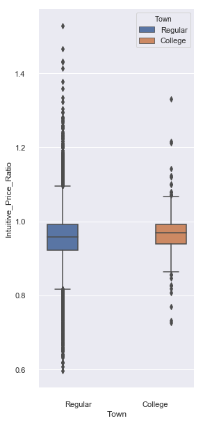
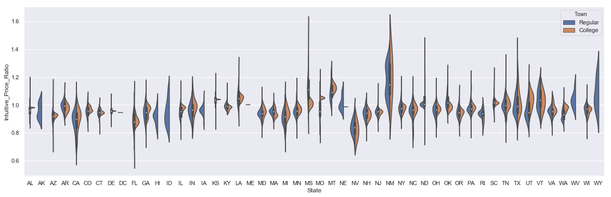

- title: How do college town home prices fare during recession?
- slug: how-do-college-town-home-prices-fare-during-recession
- date: 2019-05-30
- author: Rob Osterburg
- category: Data Science
- tags: pandas, statistics, analysis wrangling

During recession home prices suffer.  How do college towns compare to other communities?  Let's find out.  But first a few definitions.  

* A _quarter_ is a specific three month period, Q1 is January through March, Q2 is April through June, Q3 is July through September, Q4 is October through December.

* A _recession_ is defined as starting with two consecutive quarters of GDP decline, and ending with two consecutive quarters of GDP growth.

* A _recession bottom_ is the quarter within a recession which had the lowest GDP.

* A _university town_ is a city which has a high percentage of college students compared to the total population of the city.

## Hypothesis

**College towns have their mean housing prices less effected by recessions. Run a t-test to compare the ratio of the mean price of houses in university towns the quarter before the recession starts compared to the recession bottom.  Values less than one show home price increases and greater than one show home price declines.**

## Data

* From the [Zillow research data site](http://www.zillow.com/research/data/) there is housing data for the United States. In particular the datafile for [all homes at a city level](http://files.zillowstatic.com/research/public/City/City_Zhvi_AllHomes.csv), ```zillow_homes_prices_by_city.csv```, has median home sale prices at a fine grained level.

* From the Wikipedia page on college towns is a list of [college towns in the United States](https://en.wikipedia.org/wiki/List_of_college_towns#College_towns_in_the_United_States) which has been pasted into the file ```college_towns.txt```.

* From Bureau of Economic Analysis, US Department of Commerce, the [GDP over time](http://www.bea.gov/national/index.htm#gdp) of the United States in current dollars (use the chained value in 2009 dollars), in quarterly intervals, in the file ```gdplev.xls```. For this project, I will only look at GDP data from the first quarter of 2000 onward.


```python
import pandas as pd
import numpy as np
import seaborn as sns
from scipy.stats import ttest_ind
```


```python
# Use fully spelled out place names
states = {'OH': 'Ohio', 'KY': 'Kentucky', 'AS': 'American Samoa', 'NV': 'Nevada', 'WY': 'Wyoming', 'NA': 'National', 'AL': 'Alabama', 'MD': 'Maryland', 'AK': 'Alaska', 'UT': 'Utah', 'OR': 'Oregon', 'MT': 'Montana', 'IL': 'Illinois', 'TN': 'Tennessee', 'DC': 'District of Columbia', 'VT': 'Vermont', 'ID': 'Idaho', 'AR': 'Arkansas', 'ME': 'Maine', 'WA': 'Washington', 'HI': 'Hawaii', 'WI': 'Wisconsin', 'MI': 'Michigan', 'IN': 'Indiana', 'NJ': 'New Jersey', 'AZ': 'Arizona', 'GU': 'Guam', 'MS': 'Mississippi', 'PR': 'Puerto Rico', 'NC': 'North Carolina', 'TX': 'Texas', 'SD': 'South Dakota', 'MP': 'Northern Mariana Islands', 'IA': 'Iowa', 'MO': 'Missouri', 'CT': 'Connecticut', 'WV': 'West Virginia', 'SC': 'South Carolina', 'LA': 'Louisiana', 'KS': 'Kansas', 'NY': 'New York', 'NE': 'Nebraska', 'OK': 'Oklahoma', 'FL': 'Florida', 'CA': 'California', 'CO': 'Colorado', 'PA': 'Pennsylvania', 'DE': 'Delaware', 'NM': 'New Mexico', 'RI': 'Rhode Island', 'MN': 'Minnesota', 'VI': 'Virgin Islands', 'NH': 'New Hampshire', 'MA': 'Massachusetts', 'GA': 'Georgia', 'ND': 'North Dakota', 'VA': 'Virginia'}
```


```python
def get_list_of_university_towns():
    """Returns a DataFrame of towns and the states they are in from the 
    university_towns.txt list. The format of the DataFrame should be:
    DataFrame( [ ["Michigan", "Ann Arbor"], ["Michigan", "Yipsilanti"] ], 
    columns=["State", "RegionName"]  )
    
    The following cleaning needs to be done:

    1. For "State", removing characters from "[" to the end.
    2. For "RegionName", when applicable, removing every character from " (" to the end.
    3. Depending on how you read the data, you may need to remove newline character '\n'. """
    
    towns_by_state = {}
    towns = []
    with open('data/college_towns.txt') as fin:
        for line in fin:
            if '[edit]' in line:
                if len(towns) > 1:
                    towns_by_state[state] = towns
                state = line.split('[')[0].strip()
                towns = []
            elif (line.find(',') != -1) and (line.find('(') != -1) and (line.find(',') < line.find('(')) :
                town = line.split(',')[0].strip()
                towns.append(town)
            elif line.find('(') != -1:
                town = line.split('(')[0].strip()
                towns.append(town)
            elif line.find(',') != -1:
                town = line.split(',')[0].strip()
                towns.append(town)
    state_town_tups = [tuple((state, town)) for state, towns in towns_by_state.items() for town in towns]
    df = pd.DataFrame(data=state_town_tups, columns=['State', 'RegionName'])
    df.State.map(states)
    return df
    
```


```python
get_list_of_university_towns().head()
```


<div>
<table border="1" class="dataframe">
  <thead>
    <tr style="text-align: right;">
      <th></th>
      <th>State</th>
      <th>RegionName</th>
    </tr>
  </thead>
  <tbody>
    <tr>
      <th>0</th>
      <td>North Dakota</td>
      <td>Fargo</td>
    </tr>
    <tr>
      <th>1</th>
      <td>North Dakota</td>
      <td>Grand Forks</td>
    </tr>
    <tr>
      <th>2</th>
      <td>Colorado</td>
      <td>Alamosa</td>
    </tr>
    <tr>
      <th>3</th>
      <td>Colorado</td>
      <td>Boulder</td>
    </tr>
    <tr>
      <th>4</th>
      <td>Colorado</td>
      <td>Durango</td>
    </tr>
  </tbody>
</table>
</div>


```python
def gdp_data():
    """Return a dataframe containing the quarterly GDP data expressed in 2009 dollars."""
    
    df = pd.read_excel('data/gdplev.xls', 
        skiprows=7, 
        usecols=[4, 5, 6], 
        names=['qtr', 'gdp_curr', 'gdp_2009'])
    return df

gdp_data().head()
```


<div>
<table border="1" class="dataframe">
  <thead>
    <tr style="text-align: right;">
      <th></th>
      <th>qtr</th>
      <th>gdp_curr</th>
      <th>gdp_2009</th>
    </tr>
  </thead>
  <tbody>
    <tr>
      <th>0</th>
      <td>1947q1</td>
      <td>243.1</td>
      <td>1934.5</td>
    </tr>
    <tr>
      <th>1</th>
      <td>1947q2</td>
      <td>246.3</td>
      <td>1932.3</td>
    </tr>
    <tr>
      <th>2</th>
      <td>1947q3</td>
      <td>250.1</td>
      <td>1930.3</td>
    </tr>
    <tr>
      <th>3</th>
      <td>1947q4</td>
      <td>260.3</td>
      <td>1960.7</td>
    </tr>
    <tr>
      <th>4</th>
      <td>1948q1</td>
      <td>266.2</td>
      <td>1989.5</td>
    </tr>
  </tbody>
</table>
</div>


```python
# better approach
def qtr_to_prd(df):
    """Return the provided dataframe converting the quarterly dates expressed as strings 
    to Pandas' Period objects contained in the 'date' column, year in the 'year' column 
    and the number of the quarter in the 'qtr' column. """
    
    df['date'] = pd.to_datetime(df.qtr).dt.to_period('q')
    df['year'] = df['date'].dt.year
    df['qtr'] = df['date'].dt.quarter
    return df
```


```python
qtr_to_prd(gdp_data()).head()
```


<div>
<table border="1" class="dataframe">
  <thead>
    <tr style="text-align: right;">
      <th></th>
      <th>qtr</th>
      <th>gdp_curr</th>
      <th>gdp_2009</th>
      <th>date</th>
      <th>year</th>
    </tr>
  </thead>
  <tbody>
    <tr>
      <th>0</th>
      <td>1</td>
      <td>243.1</td>
      <td>1934.5</td>
      <td>1947Q1</td>
      <td>1947</td>
    </tr>
    <tr>
      <th>1</th>
      <td>2</td>
      <td>246.3</td>
      <td>1932.3</td>
      <td>1947Q2</td>
      <td>1947</td>
    </tr>
    <tr>
      <th>2</th>
      <td>3</td>
      <td>250.1</td>
      <td>1930.3</td>
      <td>1947Q3</td>
      <td>1947</td>
    </tr>
    <tr>
      <th>3</th>
      <td>4</td>
      <td>260.3</td>
      <td>1960.7</td>
      <td>1947Q4</td>
      <td>1947</td>
    </tr>
    <tr>
      <th>4</th>
      <td>1</td>
      <td>266.2</td>
      <td>1989.5</td>
      <td>1948Q1</td>
      <td>1948</td>
    </tr>
  </tbody>
</table>
</div>


```python
# an alternate approach using pandas "str" accessor
def qrt_to_dt(df):
    """Return the provided dataframe converting the quarterly dates expressed as strings 
    to Pandas' Period objects contained in the 'date' column, year in the 'year' column 
    and the number of the quarter in the 'qtr' column. """
    
    df['date'] = df.qtr.copy()
    df[['year', 'qtr']] = df['qtr'].str.split('q', expand=True)
    df.year = df.year.astype(int)
    return df
```


```python
def gdp_change(df):
    """Return a Series containing the differences between an element 
    and the value in the previous row of the gdp_2009 column."""
    
    return df.gdp_2009.diff()
```


```python
def is_increasing(df):
    """Return a Series of floating point values containing 1.0 if the value
    in the 'delta' column is greater than 0, otherwise 0.0 is returned."""
    
    return (df['delta'] > 0).astype(float)
```


```python
df = gdp_data()
df = qtr_to_prd(df).set_index('date')
df['delta'] = gdp_change(df)
df['increasing'] = is_increasing(df)
df.head()
```


<div>
<table border="1" class="dataframe">
  <thead>
    <tr style="text-align: right;">
      <th></th>
      <th>qtr</th>
      <th>gdp_curr</th>
      <th>gdp_2009</th>
      <th>year</th>
      <th>delta</th>
      <th>increasing</th>
    </tr>
    <tr>
      <th>date</th>
      <th></th>
      <th></th>
      <th></th>
      <th></th>
      <th></th>
      <th></th>
    </tr>
  </thead>
  <tbody>
    <tr>
      <th>1947Q1</th>
      <td>1</td>
      <td>243.1</td>
      <td>1934.5</td>
      <td>1947</td>
      <td>NaN</td>
      <td>0.0</td>
    </tr>
    <tr>
      <th>1947Q2</th>
      <td>2</td>
      <td>246.3</td>
      <td>1932.3</td>
      <td>1947</td>
      <td>-2.2</td>
      <td>0.0</td>
    </tr>
    <tr>
      <th>1947Q3</th>
      <td>3</td>
      <td>250.1</td>
      <td>1930.3</td>
      <td>1947</td>
      <td>-2.0</td>
      <td>0.0</td>
    </tr>
    <tr>
      <th>1947Q4</th>
      <td>4</td>
      <td>260.3</td>
      <td>1960.7</td>
      <td>1947</td>
      <td>30.4</td>
      <td>1.0</td>
    </tr>
    <tr>
      <th>1948Q1</th>
      <td>1</td>
      <td>266.2</td>
      <td>1989.5</td>
      <td>1948</td>
      <td>28.8</td>
      <td>1.0</td>
    </tr>
  </tbody>
</table>
</div>


```python
def recession_prep(df):
    """Return the dataframe with columns added that support analysis of recessions. 
    In particular, determine if GDP is increasing or decreasing by using the shift method
    to create a Series of duplicated values that have been shifted by the number of
    rows specified.  Together the shifted columns allow for the quarter in which a recession 
    starts and ends to be indentified."""
    
    df = qtr_to_prd(df).set_index('date')
    df['delta'] = gdp_change(df)
    df['increasing'] = is_increasing(df)
    df['prv1'] = df['increasing'].shift(1)  # look back one
    df['prv2'] = df['increasing'].shift(2)
    df['curr'] = df['increasing']
    df['nxt1'] = df['increasing'].shift(-1) # look ahead one
    df['nxt2'] = df['increasing'].shift(-2)
    df['start'] = ((df['prv1']==1) & (df['curr']==0) & (df['nxt1']==0)).astype(float)
    df['end']   = ((df['prv2']==0) & (df['prv1']==1) & (df['curr']==1)).astype(float)
    return df

recession_prep(gdp_data()).loc['2007q3':'2010q4']
```


<div>
<table border="1" class="dataframe">
  <thead>
    <tr style="text-align: right;">
      <th></th>
      <th>qtr</th>
      <th>gdp_curr</th>
      <th>gdp_2009</th>
      <th>year</th>
      <th>delta</th>
      <th>increasing</th>
      <th>prv1</th>
      <th>prv2</th>
      <th>curr</th>
      <th>nxt1</th>
      <th>nxt2</th>
      <th>start</th>
      <th>end</th>
    </tr>
    <tr>
      <th>date</th>
      <th></th>
      <th></th>
      <th></th>
      <th></th>
      <th></th>
      <th></th>
      <th></th>
      <th></th>
      <th></th>
      <th></th>
      <th></th>
      <th></th>
      <th></th>
    </tr>
  </thead>
  <tbody>
    <tr>
      <th>2007Q3</th>
      <td>3</td>
      <td>14569.7</td>
      <td>14938.5</td>
      <td>2007</td>
      <td>99.8</td>
      <td>1.0</td>
      <td>1.0</td>
      <td>1.0</td>
      <td>1.0</td>
      <td>1.0</td>
      <td>0.0</td>
      <td>0.0</td>
      <td>0.0</td>
    </tr>
    <tr>
      <th>2007Q4</th>
      <td>4</td>
      <td>14685.3</td>
      <td>14991.8</td>
      <td>2007</td>
      <td>53.3</td>
      <td>1.0</td>
      <td>1.0</td>
      <td>1.0</td>
      <td>1.0</td>
      <td>0.0</td>
      <td>1.0</td>
      <td>0.0</td>
      <td>0.0</td>
    </tr>
    <tr>
      <th>2008Q1</th>
      <td>1</td>
      <td>14668.4</td>
      <td>14889.5</td>
      <td>2008</td>
      <td>-102.3</td>
      <td>0.0</td>
      <td>1.0</td>
      <td>1.0</td>
      <td>0.0</td>
      <td>1.0</td>
      <td>0.0</td>
      <td>0.0</td>
      <td>0.0</td>
    </tr>
    <tr>
      <th>2008Q2</th>
      <td>2</td>
      <td>14813.0</td>
      <td>14963.4</td>
      <td>2008</td>
      <td>73.9</td>
      <td>1.0</td>
      <td>0.0</td>
      <td>1.0</td>
      <td>1.0</td>
      <td>0.0</td>
      <td>0.0</td>
      <td>0.0</td>
      <td>0.0</td>
    </tr>
    <tr>
      <th>2008Q3</th>
      <td>3</td>
      <td>14843.0</td>
      <td>14891.6</td>
      <td>2008</td>
      <td>-71.8</td>
      <td>0.0</td>
      <td>1.0</td>
      <td>0.0</td>
      <td>0.0</td>
      <td>0.0</td>
      <td>0.0</td>
      <td>1.0</td>
      <td>0.0</td>
    </tr>
    <tr>
      <th>2008Q4</th>
      <td>4</td>
      <td>14549.9</td>
      <td>14577.0</td>
      <td>2008</td>
      <td>-314.6</td>
      <td>0.0</td>
      <td>0.0</td>
      <td>1.0</td>
      <td>0.0</td>
      <td>0.0</td>
      <td>0.0</td>
      <td>0.0</td>
      <td>0.0</td>
    </tr>
    <tr>
      <th>2009Q1</th>
      <td>1</td>
      <td>14383.9</td>
      <td>14375.0</td>
      <td>2009</td>
      <td>-202.0</td>
      <td>0.0</td>
      <td>0.0</td>
      <td>0.0</td>
      <td>0.0</td>
      <td>0.0</td>
      <td>1.0</td>
      <td>0.0</td>
      <td>0.0</td>
    </tr>
    <tr>
      <th>2009Q2</th>
      <td>2</td>
      <td>14340.4</td>
      <td>14355.6</td>
      <td>2009</td>
      <td>-19.4</td>
      <td>0.0</td>
      <td>0.0</td>
      <td>0.0</td>
      <td>0.0</td>
      <td>1.0</td>
      <td>1.0</td>
      <td>0.0</td>
      <td>0.0</td>
    </tr>
    <tr>
      <th>2009Q3</th>
      <td>3</td>
      <td>14384.1</td>
      <td>14402.5</td>
      <td>2009</td>
      <td>46.9</td>
      <td>1.0</td>
      <td>0.0</td>
      <td>0.0</td>
      <td>1.0</td>
      <td>1.0</td>
      <td>1.0</td>
      <td>0.0</td>
      <td>0.0</td>
    </tr>
    <tr>
      <th>2009Q4</th>
      <td>4</td>
      <td>14566.5</td>
      <td>14541.9</td>
      <td>2009</td>
      <td>139.4</td>
      <td>1.0</td>
      <td>1.0</td>
      <td>0.0</td>
      <td>1.0</td>
      <td>1.0</td>
      <td>1.0</td>
      <td>0.0</td>
      <td>1.0</td>
    </tr>
    <tr>
      <th>2010Q1</th>
      <td>1</td>
      <td>14681.1</td>
      <td>14604.8</td>
      <td>2010</td>
      <td>62.9</td>
      <td>1.0</td>
      <td>1.0</td>
      <td>1.0</td>
      <td>1.0</td>
      <td>1.0</td>
      <td>1.0</td>
      <td>0.0</td>
      <td>0.0</td>
    </tr>
    <tr>
      <th>2010Q2</th>
      <td>2</td>
      <td>14888.6</td>
      <td>14745.9</td>
      <td>2010</td>
      <td>141.1</td>
      <td>1.0</td>
      <td>1.0</td>
      <td>1.0</td>
      <td>1.0</td>
      <td>1.0</td>
      <td>1.0</td>
      <td>0.0</td>
      <td>0.0</td>
    </tr>
    <tr>
      <th>2010Q3</th>
      <td>3</td>
      <td>15057.7</td>
      <td>14845.5</td>
      <td>2010</td>
      <td>99.6</td>
      <td>1.0</td>
      <td>1.0</td>
      <td>1.0</td>
      <td>1.0</td>
      <td>1.0</td>
      <td>0.0</td>
      <td>0.0</td>
      <td>0.0</td>
    </tr>
    <tr>
      <th>2010Q4</th>
      <td>4</td>
      <td>15230.2</td>
      <td>14939.0</td>
      <td>2010</td>
      <td>93.5</td>
      <td>1.0</td>
      <td>1.0</td>
      <td>1.0</td>
      <td>1.0</td>
      <td>0.0</td>
      <td>1.0</td>
      <td>0.0</td>
      <td>0.0</td>
    </tr>
  </tbody>
</table>
</div>


```python
def get_recessions(df):
    """Return list of tuples containing the starting and ending dates for recessions."""
    
    df = df.loc['2000q1':]
    recessions = []
    is_recession = False
    start, end = None, None
    for index, row in df.iterrows():
        if row['start'] == 1.0:
            start = index
            is_recession = True
        elif is_recession and row['end'] == 1.0:
            end = index
            is_recession = False
            recessions.append((start.strftime('%Yq%q'), end.strftime('%Yq%q')))
    return recessions

get_recessions(recession_prep(gdp_data()))
```


    [('2008q3', '2009q4')]


```python
def get_recession_start():
    """Returns the year and quarter of the recession start time as a 
    string value in a format such as 2005q3."""
    
    # only one recession during this period, so no need to loop over start, end tuples
    start, end = get_recessions(recession_prep(gdp_data()))[0]
    return start

get_recession_start()
```


    '2008q3'


```python
def get_recession_end():
    """Returns the year and quarter of the recession end time as a 
    string value in a format such as 2005q3."""

    # only one recession during this period, so no need to loop over start, end tuples
    start, end = get_recessions(recession_prep(gdp_data()))[0]
    return end

get_recession_end()
```


    '2009q4'


```python
def get_recession_bottom():
    """Returns the year and quarter of the recession bottom time as a 
    string value in a format such as 2005q3."""
    
    df = recession_prep(gdp_data())
    start, end = get_recessions(df)[0]
    return df.loc[start:end, 'gdp_2009'].idxmin().strftime('%Yq%q')

get_recession_bottom()
```


    '2009q2'


```python
def convert_housing_data_to_quarters():
    """Converts the housing data to quarters and returns it as mean 
    values in a dataframe. This dataframe should be a dataframe with
    columns for 2000q1 through 2016q3, and should have a multi-index
    in the shape of ["State","RegionName"].
    """
    
    df = pd.read_csv('data/zillow_homes_prices_by_city.csv', 
                 dtype={'RegionID': 'str', 
                        'RegionName': 'str', 
                        'State': 'str',
                        'Metro': 'str',
                        'CountyName': 'str',
                        'SizeRank': 'int'})

    region_id_df = df[['RegionID', 'RegionName', 'State', 'Metro', 'CountyName', 'SizeRank']]
    region_id_df = region_id_df.assign(State=df.State.map(states))
    region_id_df.head()

    df = df.drop(['RegionName', 'State', 'Metro', 'CountyName', 'SizeRank'], axis=1)
    df = pd.melt(df,
                 id_vars=['RegionID'],
                 var_name='Date',
                 value_name='MedianSalesPrice')

    df = df.set_index(pd.to_datetime(df.Date)).sort_index()
    df = df.drop('Date', axis=1)
    df = df.loc['2000-01-01':]

    region_mean_df = df.reset_index().groupby([pd.Grouper(freq='Q', key='Date'), 'RegionID']).mean()

    joined_df = pd.merge(region_id_df, region_mean_df.reset_index(), how='inner', on='RegionID')
    
    # Note: Pivoting on State and RegionName without RegionID reduces the number of rows to 10592.
    #       Only by pivoting on all three and later dropping RegionID can I get the correct number of rows (10730)
    #       Finding this was truely painful.
    pivot_df = joined_df.pivot_table(index=['State', 'RegionID', 'RegionName'], columns='Date', values='MedianSalesPrice')
    pivot_df.columns = [c.lower() for c in pivot_df.columns.to_period('Q').format()]
    pivot_df.index = pivot_df.index.droplevel('RegionID')
    
    return pivot_df
```


```python
# save dataframe as csv
filepath = './data/effect_of_recession_on_median_home_prices.csv'
convert_housing_data_to_quarters().to_csv(filepath)
```


```python
def run_ttest():
    '''First creates new data showing the decline or growth of housing prices
    between the recession start and the recession bottom. Then runs a ttest
    comparing the university town values to the non-university towns values, 
    return whether the alternative hypothesis (that the two groups are the same)
    is true or not as well as the p-value of the confidence. 
    
    Return the tuple (different, p, better) where different=True if the t-test is
    True at a p<0.01 (we reject the null hypothesis), or different=False if 
    otherwise (we cannot reject the null hypothesis). The variable p should
    be equal to the exact p value returned from scipy.stats.ttest_ind(). The
    value for better should be either "university town" or "non-university town"
    depending on which has a lower mean price ratio (which is equivilent to a
    reduced market loss).'''
    
    # group university and non-university towns
    univ_towns = get_list_of_university_towns()
    univ_towns['Location'] = univ_towns[['State', 'RegionName']].apply(tuple, axis=1)

    # get home sales data
    sales_df = convert_housing_data_to_quarters().reset_index()
    sales_df['Location'] = sales_df[['State', 'RegionName']].apply(tuple, axis=1)

    # calculate the ratio of prices from the start to the bottom of the recession
    # smaller values indicates that homes retained their value during the recession
    sales_df['Price_Ratio'] = sales_df.loc[:, get_recession_start()] / sales_df.loc[:, get_recession_bottom()]
    sales_df = sales_df.loc[:, ['Location', 'Price_Ratio']]
    sales_df = sales_df.dropna()

    # home sales data series for university and other towns
    is_univ = sales_df.Location.isin(univ_towns.Location)
    univ_sales_df = sales_df.loc[is_univ]
    other_sales_df = sales_df.loc[~is_univ]

    # compare the means of median home prices
    _, p_value = ttest_ind(other_sales_df.Price_Ratio.values, univ_sales_df.Price_Ratio.values)

    # interpret the results
    if p_value < 0.01:
        # reject null hypothesis --> population means are different
        different = True
        better = 'university town'
    else:
        # accept null hypothesis --> population means are the same
        different = False
        better = 'non-university town'

    # return results
    return different, p_value, better

```


```python
run_ttest()
```


    (True, 0.0050464756985043489, 'university town')


---

## Results

Median home prices in college towns declined less than other towns during the recession that started in late 2008.  In this data set, college towns bet though there is a 1 in 100 chance that this conclusion is wrong. Let's dive in a little deeper into the data and see what it shows.


```python
def create_plotting_frame():
    # group university and non-university towns
    univ_towns = get_list_of_university_towns()
    univ_towns['Location'] = univ_towns[['State', 'RegionName']].apply(tuple, axis=1)

    # get home sales data
    sales_df = convert_housing_data_to_quarters().reset_index()
    sales_df['Location'] = sales_df[['State', 'RegionName']].apply(tuple, axis=1)

    # calculate a more intuitive price ratio where values above one represent price gains
    sales_df['Intuitive_Price_Ratio'] = sales_df.loc[:, get_recession_bottom()] / sales_df.loc[:, get_recession_start()]
    sales_df = sales_df.loc[:, ['Location', 'State', 'Intuitive_Price_Ratio']]
    sales_df = sales_df.dropna()

    # identify and label towns as either college or regular
    sales_df = sales_df.assign(Type=sales_df.Location.isin(univ_towns.Location))
    sales_df = sales_df.assign(Town=sales_df.Type.map({True:'College', False:'Regular'}))

    # replace long state names with two letter abbreviations for plotting
    reverse_state_lookup = {long: short for short, long in states.items()}
    sales_df = sales_df.assign(State = sales_df.State.apply(reverse_state_lookup.get))
    return sales_df
```


```python
plot_df = create_plotting_frame()
```

### Comparing College and Regular Towns

Values less than one indicate that median home prices declined during the recession.  Values above indicate higher prices at the bottom of the recession in comparison to its start.  College towns do have a subtly higher median value (indicated by the line in the middle of the box) than other towns.  The median value is uneffected by outliers (show as dots) that comprise less than 1% of all towns.  


```python
sns.set(rc={'figure.figsize':(4, 10)})
sns.boxplot(x='Town', y='Intuitive_Price_Ratio', hue='Town', data=plot_df)
sns.despine(offset=10, trim=True)
```





### State Level Median Home Prices

Let's see how values compare by state with New Mexico standing out as one of the housing markets during the recession.  The violin plot shows the distribuion of home price values by town type for each state. 


```python
sns.set(rc={'figure.figsize':(20, 6)})
sns.violinplot(x='State', y='Intuitive_Price_Ratio', hue='Town', data=plot_df, split=True)
```


    <matplotlib.axes._subplots.AxesSubplot at 0x11bc02390>





### Best and Worst States

Let's find how home prices change on the state-level by finding how much median home price changed.  To find the best and worst states, let's sort the dataframe using the ratio of price_at_bottom / price_at_start.  Indeed, New Mexico wasthe best and Nevada the worst.  


```python
# states with the best housing markets
sorted_states_df = plot_df.groupby(by='State').agg({'Intuitive_Price_Ratio': 'median'}).sort_values(by='Intuitive_Price_Ratio', ascending=False)
sorted_states_df.head(10)
```


<div>
<table border="1" class="dataframe">
  <thead>
    <tr style="text-align: right;">
      <th></th>
      <th>Intuitive_Price_Ratio</th>
    </tr>
    <tr>
      <th>State</th>
      <th></th>
    </tr>
  </thead>
  <tbody>
    <tr>
      <th>NM</th>
      <td>1.147781</td>
    </tr>
    <tr>
      <th>MS</th>
      <td>1.108406</td>
    </tr>
    <tr>
      <th>MT</th>
      <td>1.090499</td>
    </tr>
    <tr>
      <th>WY</th>
      <td>1.055361</td>
    </tr>
    <tr>
      <th>LA</th>
      <td>1.047571</td>
    </tr>
    <tr>
      <th>KS</th>
      <td>1.036582</td>
    </tr>
    <tr>
      <th>VT</th>
      <td>1.036013</td>
    </tr>
    <tr>
      <th>WV</th>
      <td>1.027663</td>
    </tr>
    <tr>
      <th>OK</th>
      <td>1.015508</td>
    </tr>
    <tr>
      <th>SC</th>
      <td>1.015338</td>
    </tr>
  </tbody>
</table>
</div>


```python
# states with the worst housing market
sorted_states_df.tail(10)
```


<div>
<table border="1" class="dataframe">
  <thead>
    <tr style="text-align: right;">
      <th></th>
      <th>Intuitive_Price_Ratio</th>
    </tr>
    <tr>
      <th>State</th>
      <th></th>
    </tr>
  </thead>
  <tbody>
    <tr>
      <th>RI</th>
      <td>0.939939</td>
    </tr>
    <tr>
      <th>WA</th>
      <td>0.931055</td>
    </tr>
    <tr>
      <th>AK</th>
      <td>0.926371</td>
    </tr>
    <tr>
      <th>ID</th>
      <td>0.924646</td>
    </tr>
    <tr>
      <th>AZ</th>
      <td>0.921471</td>
    </tr>
    <tr>
      <th>HI</th>
      <td>0.915682</td>
    </tr>
    <tr>
      <th>MI</th>
      <td>0.914556</td>
    </tr>
    <tr>
      <th>CA</th>
      <td>0.898245</td>
    </tr>
    <tr>
      <th>FL</th>
      <td>0.880623</td>
    </tr>
    <tr>
      <th>NV</th>
      <td>0.837595</td>
    </tr>
  </tbody>
</table>
</div>


### Best and Worst College Towns

Silver City, New Mexico the home of New Mexico Tech had a medain home price increase of 33% the best in the country.  The 27% decline in Riverside, California is the worst of any college town analyzed.  Hopefully they have fully recovered.  


```python
# best and worst college towns
sorted_college_df = plot_df[plot_df.Town.str.contains('College')].sort_values(by='Intuitive_Price_Ratio', ascending=False)
top_10 = sorted_college_df.head(10)
top_10
```


<div>
<table border="1" class="dataframe">
  <thead>
    <tr style="text-align: right;">
      <th></th>
      <th>Location</th>
      <th>State</th>
      <th>Intuitive_Price_Ratio</th>
      <th>Type</th>
      <th>Town</th>
    </tr>
  </thead>
  <tbody>
    <tr>
      <th>5840</th>
      <td>(New Mexico, Silver City)</td>
      <td>NM</td>
      <td>1.331176</td>
      <td>True</td>
      <td>College</td>
    </tr>
    <tr>
      <th>9705</th>
      <td>(Texas, Stephenville)</td>
      <td>TX</td>
      <td>1.215334</td>
      <td>True</td>
      <td>College</td>
    </tr>
    <tr>
      <th>6991</th>
      <td>(North Dakota, Grand Forks)</td>
      <td>ND</td>
      <td>1.211294</td>
      <td>True</td>
      <td>College</td>
    </tr>
    <tr>
      <th>5013</th>
      <td>(Montana, Bozeman)</td>
      <td>MT</td>
      <td>1.142552</td>
      <td>True</td>
      <td>College</td>
    </tr>
    <tr>
      <th>8616</th>
      <td>(Pennsylvania, California)</td>
      <td>PA</td>
      <td>1.122962</td>
      <td>True</td>
      <td>College</td>
    </tr>
    <tr>
      <th>9693</th>
      <td>(Texas, Lubbock)</td>
      <td>TX</td>
      <td>1.120328</td>
      <td>True</td>
      <td>College</td>
    </tr>
    <tr>
      <th>5020</th>
      <td>(Montana, Missoula)</td>
      <td>MT</td>
      <td>1.101759</td>
      <td>True</td>
      <td>College</td>
    </tr>
    <tr>
      <th>2987</th>
      <td>(Indiana, West Lafayette)</td>
      <td>IN</td>
      <td>1.099918</td>
      <td>True</td>
      <td>College</td>
    </tr>
    <tr>
      <th>9819</th>
      <td>(Utah, Salt Lake City)</td>
      <td>UT</td>
      <td>1.081056</td>
      <td>True</td>
      <td>College</td>
    </tr>
    <tr>
      <th>9852</th>
      <td>(Vermont, Burlington)</td>
      <td>VT</td>
      <td>1.077434</td>
      <td>True</td>
      <td>College</td>
    </tr>
  </tbody>
</table>
</div>


```python
bottom_10 = sorted_college_df.tail(10)
bottom_10
```


<div>
<table border="1" class="dataframe">
  <thead>
    <tr style="text-align: right;">
      <th></th>
      <th>Location</th>
      <th>State</th>
      <th>Intuitive_Price_Ratio</th>
      <th>Type</th>
      <th>Town</th>
    </tr>
  </thead>
  <tbody>
    <tr>
      <th>523</th>
      <td>(California, Sacramento)</td>
      <td>CA</td>
      <td>0.856530</td>
      <td>True</td>
      <td>College</td>
    </tr>
    <tr>
      <th>1558</th>
      <td>(Florida, Orlando)</td>
      <td>FL</td>
      <td>0.855448</td>
      <td>True</td>
      <td>College</td>
    </tr>
    <tr>
      <th>2826</th>
      <td>(Indiana, South Bend)</td>
      <td>IN</td>
      <td>0.846934</td>
      <td>True</td>
      <td>College</td>
    </tr>
    <tr>
      <th>4391</th>
      <td>(Michigan, Flint)</td>
      <td>MI</td>
      <td>0.828449</td>
      <td>True</td>
      <td>College</td>
    </tr>
    <tr>
      <th>576</th>
      <td>(California, Merced)</td>
      <td>CA</td>
      <td>0.825599</td>
      <td>True</td>
      <td>College</td>
    </tr>
    <tr>
      <th>963</th>
      <td>(California, Turlock)</td>
      <td>CA</td>
      <td>0.818946</td>
      <td>True</td>
      <td>College</td>
    </tr>
    <tr>
      <th>6802</th>
      <td>(North Carolina, Cullowhee)</td>
      <td>NC</td>
      <td>0.806439</td>
      <td>True</td>
      <td>College</td>
    </tr>
    <tr>
      <th>5045</th>
      <td>(Nevada, Las Vegas)</td>
      <td>NV</td>
      <td>0.770192</td>
      <td>True</td>
      <td>College</td>
    </tr>
    <tr>
      <th>518</th>
      <td>(California, Pomona)</td>
      <td>CA</td>
      <td>0.731259</td>
      <td>True</td>
      <td>College</td>
    </tr>
    <tr>
      <th>862</th>
      <td>(California, Riverside)</td>
      <td>CA</td>
      <td>0.726472</td>
      <td>True</td>
      <td>College</td>
    </tr>
  </tbody>
</table>
</div>


